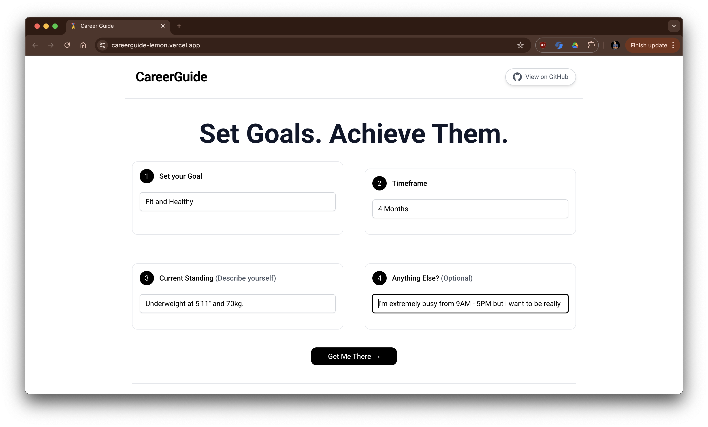

# Career Guide
All of us need guidance and help from time to time. But when it comes to specific goals and ambitions, getting this help becomes difficult. This is what Career guide is for. It is an AI powered platform which analyses your goals and tries to provide you a concrete path to achieve them. It is not just limited to career goals but can be used everywhere - personality goals / financial goals / health goals etc.

TLDR; This App helps you achieve your goals by providing you a detailed plan, timeline and timetable to follow.

## How to use

- Website
    - Visit the website [here](https://careerguide-lemon.vercel.app) !
    - Fill in the details.
    - What you want to achieve, how fast do you want to achieve that, what is your current status and any other details you find relevant.
    - Click on Get Me There and wait for the magic to happen.
    - The AI will process, think and come up with three things for you - an overview plan, a timeline and a daily timetable to follow.

    
    

- Local Development
    - Clone the repository
    - Create a `.env` file in the root directory and add the following
        ```
        API_KEY=<your api key for gemini ai>
        ```
    - Run `npm install`
    - Run `npm run dev`
    - Visit `http://localhost:3000`

## Features
- AI powered
- Timetable
- Detailed and Overview Plan
- Timeline
- Completely unique based on input 

## Tech Stack
- NextJS / ReactJS
- TailwindCSS
- Gemini API for AI content generation
- Hosted on Vercel

## Inspiration
So, this stemmed from me myself thinking a lot about my future path and all the vast possibilities open to me. I realised I needed to see concrete steps and a plan to follow. Well, why not make an app for it? and why not AI ? So, here it is. Built with love.

## Future Scope
Lots of features to come in the future.
- More detailed plans
- Include more factors 
- Include resources and links